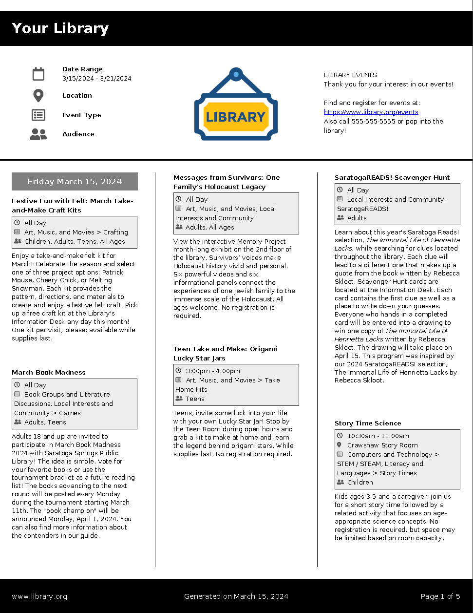

# Custom Event Brochure Generator

mPDF is a PHP library used in the generation of PDFs. This project uses an ever-so-slightly modified version of that library to generate a PDF brochure of
library events, customized to the interests of your patrons. A date range can be chosen (default is set to the current week), and it can also be filtered
by audience type, event categories, and location (space). This is the configuration that is provided in the example, but it could be extended to use any
available attributes as provided in the SQLite database that this project maintains.

An example HTML form is provided so that, once this repository's main `config.php` file is setup appropriately and the SQLite database is primed, this can be tested immediately.

The following values can be customized without needing to understand PHP:

```php
#######################################################
## Customize your generated PDF's branding and usage ##
#######################################################

// Library name
$library_name   = 'Your Library';
// Used in the PDF footer, for branding
$lib_www_home   = 'www.library.org';
// Webpage to point to your event calendar
$event_cal_url  = 'https://www.library.org/events';
// Primary contact phone for event information
$contact_phone  = '555-555-5555';
// Library brand color; used in various places
$brand_color    = '';
// Light color used as event detail (text) background
$light_color    = '';
// Darker color used as event detail border color
$dark_color     = '';
// Background color for notice of registration required
$register_color = '';
// Background color for when the event waitlist is active/in use
$waitlist_color = '';
// Custom text to use for the "Registration is Required" message
$register_msg   = '';
// Custom text to use for when an event is full, but there's a waitlist
$waitlist_msg   = '';
// Do, or don't, render *some* event images; images severely hurt rendering
$render_images  = false;
// IDs of categories that can be assigned a different event title text color (ex: closings/holidays)
$notice_cat_ids = [42786];
// Matching color to IDs of "notice_catories" that will assign text color
$notice_colors  = ['red'];
// Show events if they are full AND there is no waitlist
$show_if_full   = false;
// Show events if they are full, but there's a waitlist
$show_waitlist  = true;
// The name of the file that will be provided to the end user
$filename       = 'Program Brochure ' . date('n-j-Y');
// Location/path of a logo image to use
$logo_img_path  = '../library-svgrepo-com.svg';
```



> [!NOTE]
> The image above shows the example PDF that has not been customized to a library's chosen brand colors. See above for available customization options.