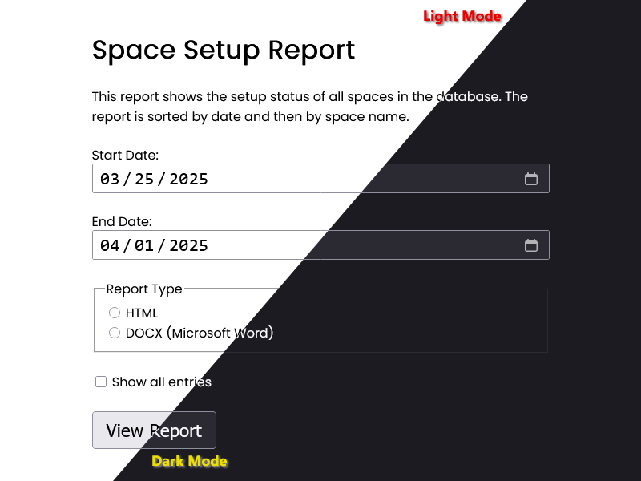
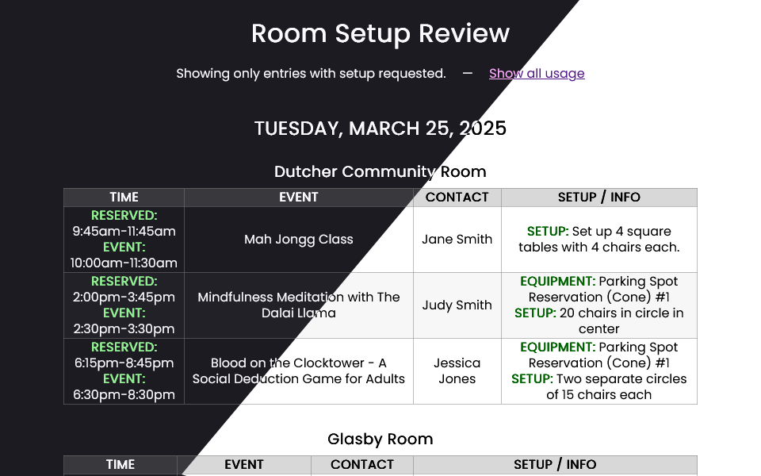
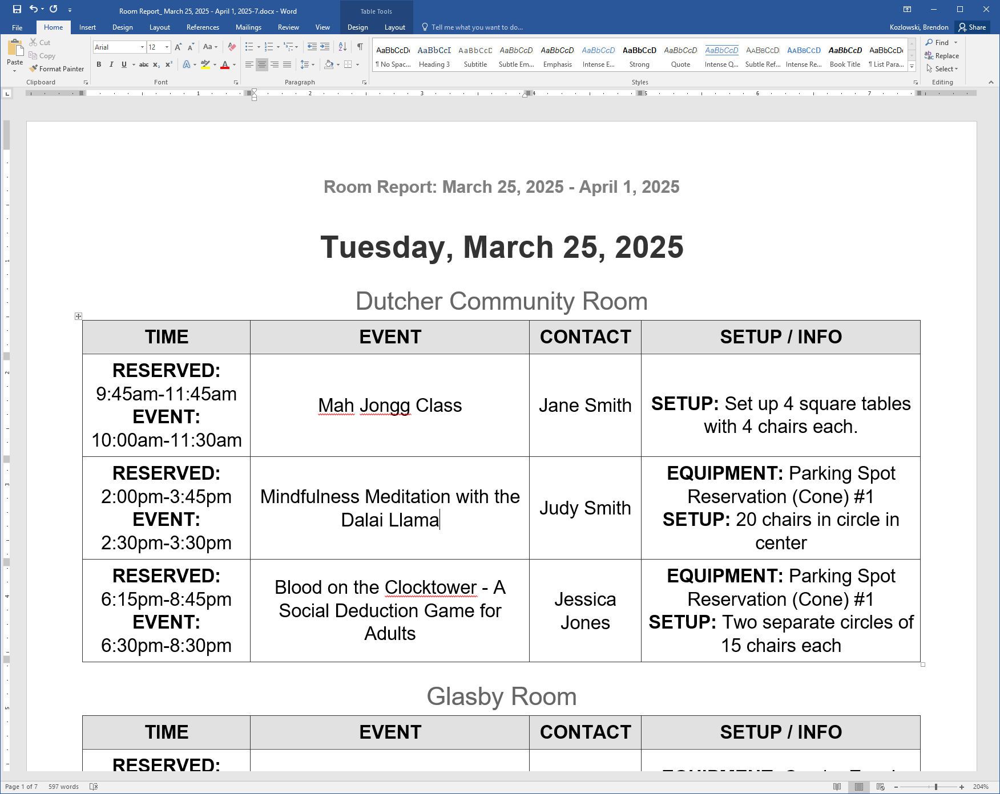

# Room Setup Report

This example was based on a project that our library had already created quite a long time ago. That project was, unfortunately, quite integrated into our other systems.

Quite a few libraries had also expressed interest in having the ability to generate a "Room Setup Report" that could be provided to operations or facilities staff to prepare the spaces ahead of time. This is exactly what our usecase was for as well.

So long as a library provides the textual description of how to set up a room (non-equipment items) in LibCal's event's "Event Info" text field, that will then be included in this report. Any equipment that is directly associated with an event, or a room booking, will be included in this report (as will the date, start and end times, location, and associated event owner and/or booking contact name). _*This information is intended for staff-only viewing to protect privacy._*

> [!NOTE]
> Want to build your own reporting interface? After submitting the form to generate query string values, replace the parameter `&report_type=[...]` with `?json` and it will load up the information in a JSON'ified and capturable format.

The generated report can be rendered in either an HTML or Microsoft Word document format. See example photos below.

## Image Examples of the Interface

### Form Interface

### Room Report (HTML)

### Room Report (DOCX)
