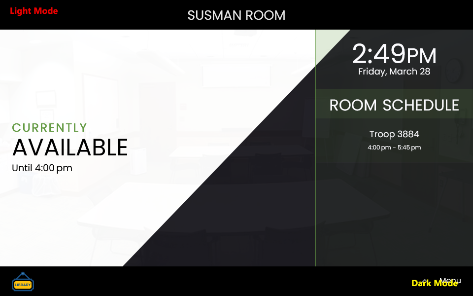

# Alternative Room Tablet Display Interface

Springshare's Kiosk/Tablet page is a very nice option that is (currently?) provided freely with the Spaces module. It's awesome that they created such a tool, and I'm quite happy they released it as I was also building a similar solution!

Likely because I had already begun planning and building a competing solution, my idea for a solution veered significantly from theirs, and although there is some similarity, I personally felt their offering had some missed opportunities. With some continued development, our solution now lives!

This example project is based on that effort, but stripped and decoupled from our customizations to make it more generic and friendlier to (hopefully) all possible uses of other libraries. _(Untested: Multiple branched libraries, or the Seats module.)_

**Limitations:**

- Does not auto-reload the page. This could be fixed fairly easily, but we chose to take advantage of the [Fully Kiosk Browser](https://www.fully-kiosk.com/) Lockdown tool (Android) to far more easily configure how to manage screen refresh, resetting of the display, screensavers, and similar functionality. This is a very powerful and very inexpensive app that makes managing tablet (kiosk-style) displays extremely easy.
  
  Cannot book a space. The API does offer booking, but it's too configurable to know how each library would want to handle this scenario.
  
  - Since all code is included, libraries are free to further customize the templates to handle this, however, such as embedding a QR code that points to the booking form (as Springshare does)

- Due to API limitations with the Hours module, the closing time of the spaces cannot be determined dynamically and automatically.

- Does not navigate to different days like Springshare's solution; this was a decision made to focus on the information for the here-and-now and remove additional distractions.

**Benefits:**

- It knows about the Events' setup and breakdown times, and considers that when displaying the room's status.

- Automatic Light / Dark mode, depending on the tablet settings.

- Displays space photos pulled from LibCal

- Displays event photos as pulled from LibCal (during an event), and the events' descriptions

- Different views for landscape and portrait orientations
  
  - Priority in design was given to effective communication and visibility of information; this is difficult to do the same way for both orientations
  
  - Depending on physical space, a vertical or horizontal orientation may be preferred; alternatively, a particular view style may be preferred -- you have that option here

- Easy to interact with and see, at a glance, what is going on in a space throughout the rest of the day

- Can SWITCH rooms right from the tablet to see what is going on in another room (using Fully Kiosk Browser would allow switching back to the assigned room after a set period of time/inactivity)

- Can view a (simple) customizable, passcode-protected, STAFF ONLY VIEW for a week's worth of room booking information, including:
  
  - Event / Booking name
  
  - Start and end time of booking (and start and end time of event)
  
  - Contact name
  
  - Equipment requested (and for Events, any additional notes within the "Event Note" field)

- See an overview of the current status of all available spaces

One massive benefit of Springshare's solution is that it's purposefully simplistic. What I have noticed is that the more options that Springshare provides in their products, the more variance and customization they are asked for. As this solution, in my opinion, goes quite a bit further in customizing a tablet experience, I can see there being a lot of potential desire for, *"can't we just do this one other thing too?"* situations. The nice thing is that, if you have a developer on staff, or someone interested in trying to get into adjusting this code -- you can! If it is seemingly a universal fix that might benefit everyone - submit a pull request (please)! It could even just be alternative CSS stylesheets, or room setup view files...

## What does it look like? Show examples!

Okay! Please remember that the light/dark view is customizable, much of the text is customizable, and the logo icon (bottom left) is customizable.

### Room Status

This view sorts the spaces by active status first, and then sorts the spaces alphabetically by space name second. When a space is actively being used, the event image (if it is an event) is fully opaque, or the space image is used (if no event image, or if it's a public booking), but is also fully opaque. The space name is swapped with the booking nickname or the event name for findability - once clicked on, the full information of that space is shown.

### Room Status (Specific Room, Landscape)

The landscape view had enough room for a clock... It shows the current date and time, the current status of the room, and on click/tap of the status (if the space is in use) will provide information (image below). The room's future schedule for the current day would appear below the clock and is vertically scrollable.

### Room Status (Specific Room, Portrait)

The portrait view does away with the clock for the benefit of pertinent information and readability. The functionality is otherwise the same, except the room's future schedule for the current day is scrollable horizontally.

### Description While in Use

Tapping or clicking on the current event/booking provides a description.

- Event: Pulls and displays the event's description field value

- Booking: Displays a custom message

### 7 Days of Scheduled Room Usage

A simple passcode-protected interface that displays room usage and associated equipment requests for the next week.

